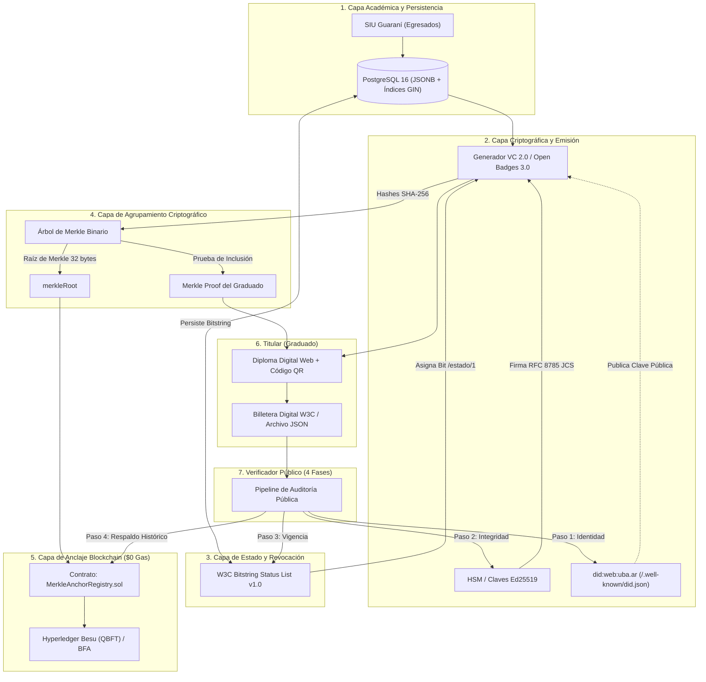

# Títulos Universitarios Verificables — Universidad de Buenos Aires (UBA)

> **Entorno de Referencia y Arquitectura Técnica de Producción**  
> Basado en la propuesta técnica para la Secretaría Académica:  
> **W3C VC 2.0 / Open Badges 3.0 + did:web + Bitstring Status List v1.0 + Anclaje en BFA / Hyperledger Besu (QBFT)**.

Este repositorio contiene la implementación técnica completa, funcional y desacoplada del sistema de emisión, anclaje y validación descentralizada de títulos universitarios oficiales para la **Universidad de Buenos Aires (UBA)**.

El sistema fue diseñado bajo estrictos principios de **soberanía tecnológica**, **costo cero de operación**, **respeto por la privacidad de datos (Ley 25.326)** y **adopción de estándares abiertos del W3C**.

---

## 📋 Tabla de Contenidos
1. [¿Qué Hace el Programa?](#-qué-hace-el-programa)
2. [Principios de Diseño y Ventajas Estratégicas](#-principios-de-diseño-y-ventajas-estratégicas)
3. [Arquitectura Global del Sistema](#-arquitectura-global-del-sistema)
4. [Componentes y Mapeo en el Código Fuente](#-componentes-y-mapeo-en-el-código-fuente)
5. [Flujo de Vida de un Título Universitario](#-flujo-de-vida-de-un-título-universitario)
6. [Pipeline de Verificación en 4 Fases](#-pipeline-de-verificación-en-4-fases)
7. [Módulos del Panel de Control Web](#-módulos-del-panel-de-control-web)
8. [Detalle de la API HTTP (Astro SSR)](#-detalle-de-la-api-http-astro-ssr)
9. [Modelo de Datos y Contratos](#-modelo-de-datos-y-contratos)
10. [Inicio Rápido e Instalación](#-inicio-rápido-e-instalación)
11. [Banco de Pruebas y Ciberseguridad](#-banco-de-pruebas-y-ciberseguridad)
12. [Marco Legal y Privacidad](#-marco-legal-y-privacidad)

---

## 🎯 ¿Qué Hace el Programa?

El programa resuelve integralmente la emisión, custodia, revocación y verificación internacional de títulos de grado y posgrado de la UBA sin depender de registros en papel, trámites consulares ni plataformas propietarias cerradas.

### Funciones Principales:
1. **Emisión de Credenciales W3C VC 2.0 / Open Badges 3.0**:
   - Toma los datos académicos de los egresados desde la base académica institucional (**SIU Guaraní**).
   - Genera una credencial estructurada en formato estándar internacional W3C JSON-LD.
   - Aplica una huella criptográfica SHA-256 anónima al documento de identidad (DNI) para preservar la privacidad.
   - Firma digitalmente la credencial mediante criptografía asimétrica **Ed25519** utilizando la clave privada institucional custodiada (módulo HSM) y canonicalización determinista **RFC 8785 (JCS)**.

2. **Revocación Fuera de Cadena Ultraliviana (Bitstring Status List v1.0)**:
   - Asigna a cada título un índice numérico en una lista de bits institucional.
   - Si un título debe ser revocado o corregido, se conmuta un bit (`0 = vigente`, `1 = revocado`) sin necesidad de emitir transacciones costosas ni reescribir la blockchain.
   - Comprime hasta 100.000 títulos en menos de 100 bytes gracias a compresión gzip y codificación Multibase.

3. **Agrupamiento en Árboles de Merkle y Anclaje Blockchain**:
   - Agrupa lotes masivos de credenciales (ej. promociones enteras de graduados) en un **Árbol de Merkle binario**.
   - Calcula una única raíz criptográfica de 32 bytes (`merkleRoot`).
   - Registra dicha raíz en un contrato inteligente de la blockchain permisionada (**Hyperledger Besu** con consenso QBFT o **Blockchain Federal Argentina - BFA**) con **costo de transacción cero ($0 gas)**.
   - Entrega a cada graduado una **prueba matemática de inclusión (Merkle Proof)** que demuestra que su título estaba contenido en ese lote sin revelar la identidad de sus compañeros.

4. **Diploma Digital Interactivo y Billetera Soberana**:
   - Permite al graduado visualizar su diploma oficial con identidad visual UBA.
   - Genera un código QR dinámico de validación inmediata.
   - Permite descargar la credencial en formato JSON firmado para importarla en billeteras digitales soberanas compatibles con W3C.

5. **Portal de Validación Pública en 4 Fases**:
   - Cualquier empleador, organismo público o universidad del mundo puede validar un título en segundos sin necesidad de credenciales de acceso ni software especializado.
   - Ejecuta una auditoría criptográfica secuencial de 4 niveles que comprueba la identidad institucional (`did:web`), la integridad matemática del documento, su estado de vigencia y su anclaje histórico.

6. **Sandbox de Resiliencia y Ciberseguridad**:
   - Permite simular ataques y escenarios de riesgo: fraude de calificaciones, revocación, diplomas retroactivos y caídas de la red blockchain.

---

## 💡 Principios de Diseño y Ventajas Estratégicas

| Principio | Implementación en este Sistema |
| :--- | :--- |
| **Costo Cero ($0 Gas)** | Basado en redes permisionadas Proof-of-Authority (**Hyperledger Besu / BFA**). Sin minería, sin criptomonedas, sin tarifas por transacción. |
| **Desacoplamiento de la Red** | La verificación cotidiana (did:web + firma Ed25519 + lista de estado) es instantánea y **no requiere conectividad con la blockchain**. La blockchain actúa como respaldo histórico inmutable. |
| **Privacidad Absoluta (Ley 25.326)** | **Cero datos personales on-chain**. En la blockchain sólo se guarda la raíz de Merkle (32 bytes). Los datos personales permanecen en custodia exclusiva del graduado y la universidad. |
| **Estándares Abiertos Globales** | Interoperable con ecosistemas internacionales gracias a **W3C VC 2.0**, **Open Badges 3.0**, **did:web** y **RFC 8785**. Sin vendor lock-in. |
| **Resiliencia Operativa** | Arquitectura con degradación elegante (*graceful degradation*): si Docker o PostgreSQL no están instalados, el sistema conmuta automáticamente a emulación EVM y almacenamiento seguro en memoria. |

---

## 🏛️ Arquitectura Global del Sistema

El siguiente diagrama detalla la interacción entre las capas del sistema:



---

## 📂 Componentes y Mapeo en el Código Fuente

| Componente Arquitectónico | Rol y Responsabilidad Técnica | Archivo en el Repositorio |
| :--- | :--- | :--- |
| **Fuente de Verdad Académica** | Modelo relacional de alumnos egresados, libro y folio | [`src/lib/academic-db.js`](file:///run/media/cetec/c182e059-3c92-4885-9b5a-0b2f0aeaadfe1/AIProjects/titulos-bc/src/lib/academic-db.js) |
| **Motor de Persistencia JSONB** | Repositorio PostgreSQL con soporte JSONB e índices GIN | [`src/lib/db.js`](file:///run/media/cetec/c182e059-3c92-4885-9b5a-0b2f0aeaadfe1/AIProjects/titulos-bc/src/lib/db.js) y [`sql/init.sql`](file:///run/media/cetec/c182e059-3c92-4885-9b5a-0b2f0aeaadfe1/AIProjects/titulos-bc/sql/init.sql) |
| **Núcleo Criptográfico** | Curva Ed25519, canonicalización JCS (RFC 8785) y multibase `z...` | [`src/core/crypto.js`](file:///run/media/cetec/c182e059-3c92-4885-9b5a-0b2f0aeaadfe1/AIProjects/titulos-bc/src/core/crypto.js) |
| **Identidad Descentralizada** | Generación y resolución estándar de `did:web:uba.ar` | [`src/core/did.js`](file:///run/media/cetec/c182e059-3c92-4885-9b5a-0b2f0aeaadfe1/AIProjects/titulos-bc/src/core/did.js) y [`src/pages/.well-known/did.json.js`](file:///run/media/cetec/c182e059-3c92-4885-9b5a-0b2f0aeaadfe1/AIProjects/titulos-bc/src/pages/.well-known/did.json.js) |
| **Lista de Estado W3C** | Bitstring comprimido gzip con prefijo multibase `u...` | [`src/core/status-list.js`](file:///run/media/cetec/c182e059-3c92-4885-9b5a-0b2f0aeaadfe1/AIProjects/titulos-bc/src/core/status-list.js) y [`src/pages/estado/[id].js`](file:///run/media/cetec/c182e059-3c92-4885-9b5a-0b2f0aeaadfe1/AIProjects/titulos-bc/src/pages/estado/[id].js) |
| **Árbol de Merkle** | Construcción de árboles binarios SHA-256 y pruebas de inclusión | [`src/core/merkle.js`](file:///run/media/cetec/c182e059-3c92-4885-9b5a-0b2f0aeaadfe1/AIProjects/titulos-bc/src/core/merkle.js) |
| **Emisor de Credenciales** | Fábrica y firmador W3C VC 2.0 y Open Badges 3.0 | [`src/core/vc.js`](file:///run/media/cetec/c182e059-3c92-4885-9b5a-0b2f0aeaadfe1/AIProjects/titulos-bc/src/core/vc.js) |
| **Pipeline Verificador** | Auditor en 4 etapas: DID, Ed25519, Bitstring y Merkle/Besu | [`src/core/verifier.js`](file:///run/media/cetec/c182e059-3c92-4885-9b5a-0b2f0aeaadfe1/AIProjects/titulos-bc/src/core/verifier.js) |
| **Smart Contract EVM** | Registro inmutable de raíces de Merkle sin datos personales | [`contracts/MerkleAnchorRegistry.sol`](file:///run/media/cetec/c182e059-3c92-4885-9b5a-0b2f0aeaadfe1/AIProjects/titulos-bc/contracts/MerkleAnchorRegistry.sol) |
| **Servicio de Anclaje** | Conector agnóstico (Hyperledger Besu RPC o Simulador EVM) | [`src/blockchain/anchor-service.js`](file:///run/media/cetec/c182e059-3c92-4885-9b5a-0b2f0aeaadfe1/AIProjects/titulos-bc/src/blockchain/anchor-service.js) |
| **Orquestador SSR / Contexto** | Singleton central institucional para Astro SSR | [`src/lib/app-context.js`](file:///run/media/cetec/c182e059-3c92-4885-9b5a-0b2f0aeaadfe1/AIProjects/titulos-bc/src/lib/app-context.js) |
| **Infraestructura Contenedores** | Besu QBFT ($0 gas) + PostgreSQL 16 Alpine | [`docker-compose.yml`](file:///run/media/cetec/c182e059-3c92-4885-9b5a-0b2f0aeaadfe1/AIProjects/titulos-bc/docker-compose.yml) y [`scripts/dev.js`](file:///run/media/cetec/c182e059-3c92-4885-9b5a-0b2f0aeaadfe1/AIProjects/titulos-bc/scripts/dev.js) |

---

## 🔄 Flujo de Vida de un Título Universitario

```
1. REGISTRO ACADÉMICO (SIU Guaraní)
   └── El egresado completa su plan de estudios (ej: Medicina, Derecho, Exactas).
   
2. EMISIÓN INSTITUCIONAL (Servicio VC 2.0)
   ├── Se genera el JSON LD conforme a W3C VC 2.0 y Open Badges 3.0.
   ├── Se hashea el DNI: sha256("38123456") (Cumplimiento Ley 25.326).
   ├── Se asigna un índice en la lista de revocación (ej: statusListIndex = 100).
   ├── Se canonicaliza el documento mediante RFC 8785 (JCS).
   └── Se firma con Ed25519 usando la clave privada institucional.

3. ANCLAJE POR LOTES (Batch Merkle Tree)
   ├── Se recopilan todas las credenciales de la colación (ej: 500 títulos).
   ├── Se calcula el hash SHA-256 de cada credencial individual.
   ├── Se construye el Árbol de Merkle binario y se obtiene la Raíz (32 bytes).
   ├── Para cada título se calcula su Merkle Proof: [{ position: 'left'|'right', hash }].
   └── Se envía la raíz al contrato inteligente MerkleAnchorRegistry.sol en Besu/BFA.

4. ENTREGA AL GRADUADO
   ├── El graduado recibe su diploma digital con QR y credencial JSON completa.
   └── Puede almacenarlo en su smartphone, billetera digital o portal web.

5. VERIFICACIÓN PÚBLICA
   └── Un tercero valida el documento en 4 fases de auditoría criptográfica.
```

---

## 🔍 Pipeline de Verificación en 4 Fases

Cuando una entidad receptora (empleador, universidad extranjera, embajada) recibe una credencial, el verificador ejecuta el pipeline de 4 fases de forma secuencial:

```
[Entrada: Credencial W3C JSON + Merkle Proof]
                       │
                       ▼
┌─────────────────────────────────────────────────────────────┐
│ FASE 1: Resolución de Identidad (did:web)                   │
│ • Consulta: https://uba.ar/.well-known/did.json             │
│ • Valida que el emisor coincida con la UBA.                 │
│ • Extrae la clave pública Ed25519 institucional activa.     │
└──────────────────────────────┬──────────────────────────────┘
                               │ (OK)
                               ▼
┌─────────────────────────────────────────────────────────────┐
│ FASE 2: Integridad Criptográfica (eddsa-rdfc-2022)          │
│ • Remueve el bloque 'proof' y canonicaliza el JSON (JCS).   │
│ • Verifica la firma digital Ed25519 con la clave pública.   │
│ • Garantiza: El título NO fue modificado en ningún caracter │
│   y fue emitido inequívocamente por la UBA.                 │
└──────────────────────────────┬──────────────────────────────┘
                               │ (OK)
                               ▼
┌─────────────────────────────────────────────────────────────┐
│ FASE 3: Estado y Revocación Dinámica (Bitstring Status List)│
│ • Descarga la lista desde https://uba.ar/estado/1           │
│ • Descomprime el mapa de bits (gzip) y lee el índice.       │
│ • Comprueba el bit correspondiente:                         │
│   - Bit = 0: Título VIGENTE.                                │
│   - Bit = 1: Título REVOCADO o rectificado.                 │
└──────────────────────────────┬──────────────────────────────┘
                               │ (OK)
                               ▼
┌─────────────────────────────────────────────────────────────┐
│ FASE 4: Respaldo Histórico e Inmutabilidad (Blockchain)     │
│ • Toma el hash de la credencial y la Merkle Proof adjunta.  │
│ • Reconstruye matemáticamente la raíz del árbol de Merkle.  │
│ • Consulta el contrato en Besu/BFA: getAnchor(merkleRoot).  │
│ • Garantiza: El título existía en la fecha del bloque y     │
│   evita cualquier intento de falsificación retroactiva.     │
└──────────────────────────────┬──────────────────────────────┘
                               │ (OK)
                               ▼
     [VEREDICTO: TÍTULO 100% AUTÉNTICO, VIGENTE Y VERIFICADO]
```

### ⚡ Propiedad de Desacoplamiento (Ventaja Operativa Fundamental)
Las **Fases 1, 2 y 3** no consultan la blockchain. Operan con tiempos de respuesta inferiores a **5 milisegundos**. Si la red blockchain estuviera en mantenimiento o el verificador no tuviera acceso a un nodo RPC, el título **sigue siendo 100% verificable** con certeza legal y matemática, garantizando continuidad de servicio internacional.

---

## 🖥️ Módulos del Panel de Control Web

La aplicación web, construida en **Astro 7 (SSR)** con arquitectura de pestañas reactivas, cuenta con 6 módulos especializados:

1. **Arquitectura y Visión Técnica** ([`src/components/ArchitectureTab.astro`](file:///run/media/cetec/c182e059-3c92-4885-9b5a-0b2f0aeaadfe1/AIProjects/titulos-bc/src/components/ArchitectureTab.astro)):
   - Diagrama interactivo del flujo de 4 niveles.
   - Tabla comparativa entre el enfoque moderno W3C/Merkle y las tecnologías heredadas (PDFs con firma digital, NFTs en Ethereum, bases centralizadas).

2. **Emisión de Títulos — SIU Guaraní** ([`src/components/IssuerTab.astro`](file:///run/media/cetec/c182e059-3c92-4885-9b5a-0b2f0aeaadfe1/AIProjects/titulos-bc/src/components/IssuerTab.astro)):
   - Gestión de egresados de facultades (Exactas, Medicina, Derecho, Ingeniería, Económicas).
   - Botón de emisión instantánea: firma en vivo con clave Ed25519 del HSM y asignación de índice de revocación.
   - Indicador de estado de la credencial (Pendiente / Emitida / Anclada).

3. **Lotes y Anclaje Merkle** ([`src/components/AnchorTab.astro`](file:///run/media/cetec/c182e059-3c92-4885-9b5a-0b2f0aeaadfe1/AIProjects/titulos-bc/src/components/AnchorTab.astro)):
   - Agrupación por lotes de títulos emitidos.
   - Cálculo visual del árbol de Merkle y generación de la raíz de 32 bytes.
   - Registro en el contrato inteligente en Besu o BFA con transacción de gas $0.
   - Monitor de bloques y estado de la red blockchain.

4. **Diploma y Billetera del Graduado** ([`src/components/GraduateTab.astro`](file:///run/media/cetec/c182e059-3c92-4885-9b5a-0b2f0aeaadfe1/AIProjects/titulos-bc/src/components/GraduateTab.astro)):
   - Visualización del diploma universitario con membrete oficial de la UBA.
   - Código QR dinámico que contiene la URL de verificación pública directa.
   - Visor y descargador del JSON-LD firmado de la Credencial Verificable y su prueba Merkle.

5. **Portal de Validación Pública** ([`src/components/VerifierTab.astro`](file:///run/media/cetec/c182e059-3c92-4885-9b5a-0b2f0aeaadfe1/AIProjects/titulos-bc/src/components/VerifierTab.astro)):
   - Interfaz para empleadores y evaluadores.
   - Permite ingresar o pegar el JSON de cualquier título emitido.
   - Ejecución gráfica de las 4 fases con indicadores luminosos (Verde = Aprobado, Rojo = Rechazado) y reporte técnico pormenorizado.

6. **Sandbox de Mitigación de Riesgos** ([`src/components/SandboxTab.astro`](file:///run/media/cetec/c182e059-3c92-4885-9b5a-0b2f0aeaadfe1/AIProjects/titulos-bc/src/components/SandboxTab.astro)):
   - Banco de pruebas en vivo de 5 escenarios críticos de seguridad informática:
     - **Caso 1: Título Legítimo y Vigente** → Las 4 fases aprueban.
     - **Caso 2: Título Revocado / Rectificado** → Falla en Fase 3 (Bitstring).
     - **Caso 3: Título Falsificado / Adulterado** → Falla en Fase 2 (Firma Ed25519 rechazada ante la alteración de un solo caracter).
     - **Caso 4: Título Retroactivo / Falso Histórico** → Falla en Fase 4 (La raíz no coincide con el registro histórico de la blockchain).
     - **Caso 5: Resiliencia ante Caída de Blockchain** → Fases 1 a 3 aprueban con éxito; demuestra continuidad operativa.

---

## 🌐 Detalle de la API HTTP (Astro SSR)

La aplicación expone una API REST moderna para interactuar con todos los servicios:

| Método | Endpoint | Descripción |
| :--- | :--- | :--- |
| `GET` | `/.well-known/did.json` | Publica el DID Document institucional oficial (`did:web:uba.ar`) y su clave pública Ed25519. |
| `GET` | `/estado/[id]` | Publica la credencial W3C Bitstring Status List v1.0 con el mapa de revocaciones comprimido. |
| `GET` | `/api/academic/graduates` | Obtiene el listado de graduados confirmados del sistema SIU Guaraní. |
| `POST` | `/api/academic/graduates` | Registra un nuevo egresado en la base académica. |
| `POST` | `/api/issuer/issue` | Emite y firma digitalmente una credencial W3C VC 2.0 para un graduado específico. |
| `GET` | `/api/issuer/credentials` | Lista todas las credenciales emitidas en el sistema. |
| `GET` | `/api/issuer/credential/[id]` | Devuelve el JSON completo de una credencial y su prueba de inclusión Merkle. |
| `POST` | `/api/issuer/batch-anchor` | Agrupa las credenciales pendientes en un árbol de Merkle y ancla la raíz en la blockchain. |
| `POST` | `/api/issuer/revoke` | Revoca un título cambiando su bit en la Bitstring Status List. |
| `POST` | `/api/issuer/unrevoke` | Restituye un título revocado a estado vigente. |
| `POST` | `/api/verifier/verify` | Ejecuta la auditoría en 4 fases sobre un payload JSON de credencial. |
| `GET` | `/api/blockchain/status` | Informa el estado de conexión del nodo Besu, red, contrato y altura de bloque. |
| `GET` | `/api/qr/[id]` | Genera y retorna el código QR en formato imagen PNG/DataURI para un diploma. |
| `GET` | `/api/simulation/scenarios` | Lista los 5 escenarios de mitigación de riesgos para pruebas. |
| `POST` | `/api/simulation/run/[scenarioId]` | Ejecuta un escenario de simulación específico y retorna el resultado de las 4 fases. |

---

## 📄 Modelo de Datos y Contratos

### 1. Estructura de la Credencial W3C VC 2.0 / Open Badges 3.0
```json
{
  "@context": [
    "https://www.w3.org/ns/credentials/v2",
    "https://purl.imsglobal.org/spec/ob/v3p0/context-3.0.3.json"
  ],
  "id": "urn:uuid:123e4567-e89b-12d3-a456-426614174000",
  "type": ["VerifiableCredential", "OpenBadgeCredential"],
  "issuer": {
    "id": "did:web:uba.ar",
    "type": ["Profile"],
    "name": "Universidad de Buenos Aires"
  },
  "validFrom": "2026-11-20T00:00:00.000Z",
  "credentialSubject": {
    "type": ["AchievementSubject"],
    "achievement": {
      "type": ["Achievement"],
      "achievementType": "BachelorDegree",
      "name": "Licenciatura en Ciencias de la Computación",
      "description": "Título universitario oficial otorgado por la Universidad de Buenos Aires a través de la Facultad de Ciencias Exactas y Naturales."
    },
    "graduate": {
      "name": "Juan Ignacio Pérez",
      "documentType": "DNI",
      "documentNumberHash": "sha256:d8e8fca2dc0f896fd7cb4cb0031ba249...",
      "faculty": "Facultad de Ciencias Exactas y Naturales",
      "graduationDate": "2026-11-20"
    }
  },
  "credentialStatus": {
    "type": "BitstringStatusListEntry",
    "statusPurpose": "revocation",
    "statusListIndex": "100",
    "statusListCredential": "https://uba.ar/estado/1"
  },
  "proof": {
    "type": "DataIntegrityProof",
    "cryptosuite": "eddsa-rdfc-2022",
    "created": "2026-11-20T12:00:00Z",
    "verificationMethod": "did:web:uba.ar#clave-2026",
    "proofPurpose": "assertionMethod",
    "proofValue": "z3A7x9B... (Firma Ed25519 en Multibase)"
  }
}
```

### 2. Esquema de Persistencia en PostgreSQL (`sql/init.sql`)
- `institutional_keys`: Almacena el par de claves institucionales (Ed25519), multibase y certificados PEM.
- `revocation_status_list`: Almacena el buffer binario `BYTEA` de 100.000 bits y el puntero al próximo índice disponible.
- `graduates`: Tabla relacional con los datos académicos de los egresados (SIU Guaraní).
- `issued_credentials`: Almacena la credencial en formato nativo `JSONB`, junto con el hash de la hoja Merkle (`leaf_hash`), la raíz y la prueba de inclusión (`merkle_proof`). Cuenta con índices GIN optimizados.
- `anchor_batches`: Registro de lotes anclados en Besu/BFA con el número de bloque y hash de transacción.

### 3. Contrato Inteligente Solidity (`MerkleAnchorRegistry.sol`)
- **Gas Cero**: Optimizado para redes permisionadas.
- **Sin datos personales**: Únicamente almacena `bytes32 merkleRoot`, `string batchId`, `uint256 timestamp`, `uint256 blockNumber` y la dirección del emisor.
- **Inmutabilidad**: Comprueba que una raíz no pueda ser anclada dos veces y emite el evento `MerkleRootAnchored`.

---

## 🚀 Inicio Rápido e Instalación

### Requisitos Previos:
- **Node.js**: v18.0 o superior (recomendado v20+ o v22+).
- **Docker y Docker Compose**: *(Opcional)* Para levantar el nodo real de Hyperledger Besu y la base PostgreSQL. Si Docker no está disponible, el sistema conmuta automáticamente al simulador EVM local y almacenamiento en memoria sin interrumpir el funcionamiento.

### 1. Clonar e Instalar Dependencias
```bash
git clone https://github.com/dracero/titulos-blochain.git titulos-bc
cd titulos-bc
npm install
```

### 2. Configurar Variables de Entorno (Opcional)
Si no existe el archivo `.env`, el script de inicio generará uno automáticamente a partir de `.env.example`:
```bash
cp .env.example .env
```

### 3. Ejecutar la Suite de Pruebas Automatizadas (21 Tests)
```bash
npm test
```
*Las 21 pruebas unitarias y de integración se ejecutan en menos de 300 ms, verificando criptografía Ed25519, canonicalización RFC 8785 JCS, Bitstring Status List, árboles de Merkle y los 5 escenarios del flujo E2E.*

### 4. Iniciar el Entorno de Desarrollo
```bash
npm run dev
```
> **¿Qué realiza automáticamente `npm run dev`?**
> 1. Detecta si Docker está disponible y levanta los contenedores de **Hyperledger Besu (QBFT)** y **PostgreSQL (JSONB)** en segundo plano.
> 2. Espera a que el puerto JSON-RPC 8545 y el puerto SQL 5432 respondan.
> 3. Despliega (o reutiliza) el contrato inteligente `MerkleAnchorRegistry` con gas $0.
> 4. Si Docker no estuviera disponible, conmuta al simulador EVM local y persistencia en memoria sin fallar.
> 5. Inicia el servidor Astro SSR con recarga en caliente en el puerto 4000.

Acceda a la aplicación web en:  
👉 **[http://localhost:4000/](http://localhost:4000/)**

---

## 🛡️ Banco de Pruebas y Ciberseguridad

El sistema incluye pruebas automatizadas contra las principales amenazas a la integridad documental:

| Escenario de Ataque o Falla | Mecanismo de Defensa en este Sistema | Resultado Observado |
| :--- | :--- | :--- |
| **Alteración de Notas o Carrera** | Canonicalización estricta RFC 8785 JCS + firma Ed25519. Cualquier caracter modificado invalida el hash. | **Falla en Fase 2**: Firma rechazada de inmediato. |
| **Emisión Retroactiva de Diplomas** | Anclaje de la raíz en la blockchain. La marca temporal del bloque y el árbol impiden fechar hacia atrás. | **Falla en Fase 4**: Raíz ausente en bloques históricos. |
| **Revocación por Fraude Académico** | Bitstring Status List v1.0. Se cambia el bit de 0 a 1 fuera de cadena. | **Falla en Fase 3**: Marcado como revocado sin alterar la blockchain. |
| **Caída de Conectividad o Bloqueo** | Desacoplamiento arquitectónico. Las fases 1, 2 y 3 son autónomas. | **Éxito en Fases 1 a 3**: Validación offline garantizada. |

---

## ⚖️ Marco Legal y Privacidad

- **Ley 25.326 de Protección de Datos Personales (Argentina)**:  
  En estricto cumplimiento con la legislación nacional y el derecho al olvido, **nunca se escriben nombres, documentos ni calificaciones en la cadena de bloques**. La blockchain sólo almacena raíces de Merkle de 32 bytes matemáticamente irreversibles.
- **Soberanía y Portabilidad de Datos**:  
  El graduado es el único custodio y dueño de su credencial digital, pudiendo presentarla ante cualquier verificador sin pedir autorización a terceros intermediarios.
- **Licencia**:  
  Código libre, auditable y 100% de código abierto.
